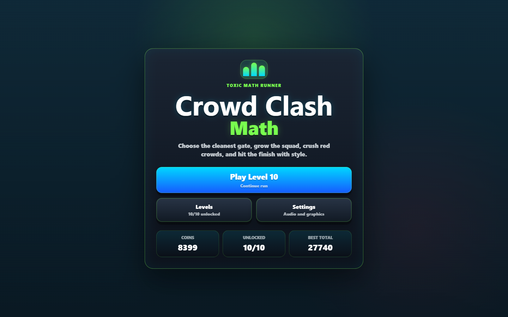
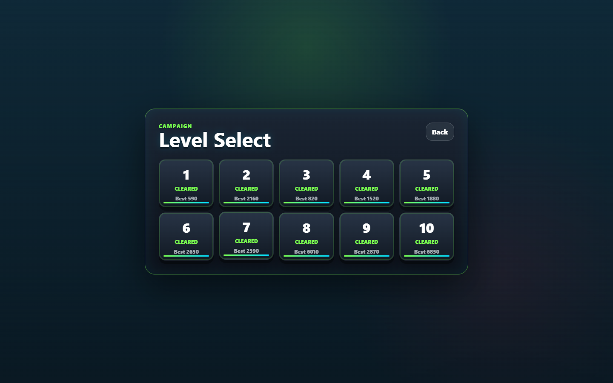
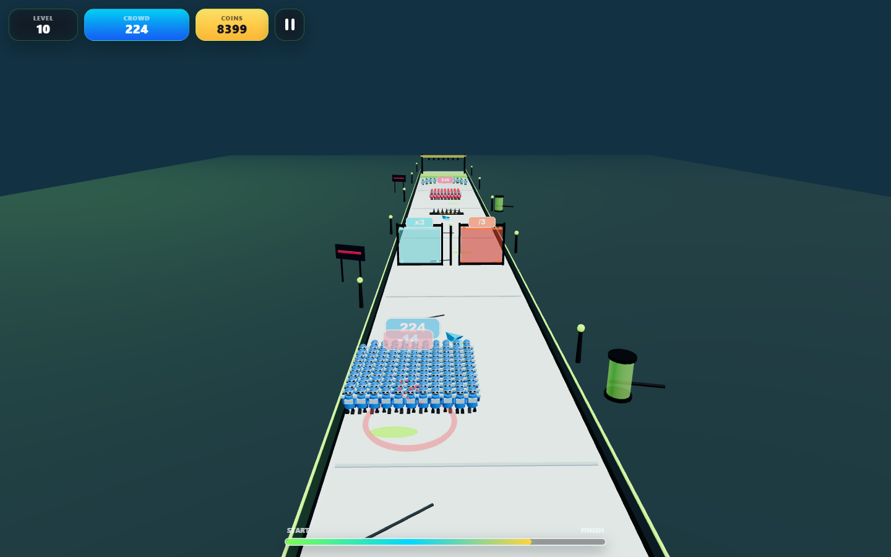
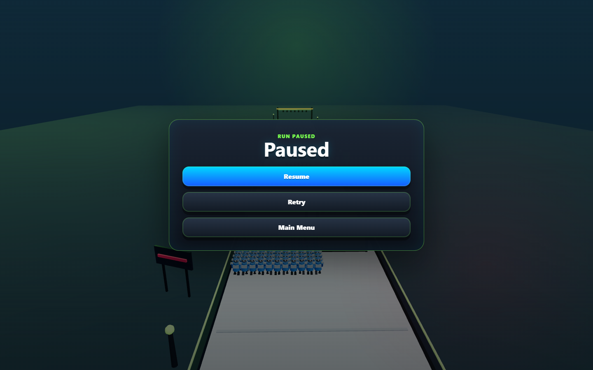
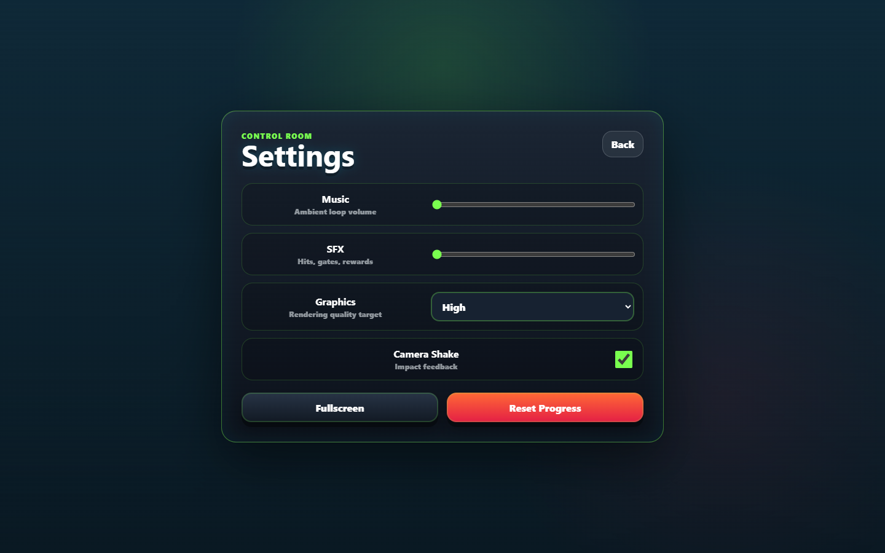

# Crowd Clash Math

A complete browser-based 3D hyper-casual runner built with Vite, TypeScript, Three.js, DOM UI overlays, localStorage saves, and procedural Web Audio sounds.

## Setup

```bash
npm install
npm run dev
```

Open the local Vite URL shown in the terminal.

## Scripts

```bash
npm run dev
npm run typecheck
npm run build
npm run preview
```

## Controls

- Mouse drag or touch drag: move the crowd left/right
- A / D or Left / Right arrows: move left/right
- P or Escape: pause while playing

## Features

- 10 playable levels with gates, enemies, collectibles, obstacles, and finish rewards
- Blue player crowd and red enemy crowds made from procedural low-poly characters
- Math gates: addition, multiplication, subtraction, and division
- Rotating bars, spikes, moving blocks, and crushers
- DOM HUD, main menu, level select, pause, settings, win, and lose screens
- Progress saved in localStorage: unlocked level, coins, best scores, settings
- Procedural sounds and ambient music loop through Web Audio API
- Responsive canvas and mobile-friendly UI

## Screenshots











## Known Limitations

- All assets are procedural placeholder geometry; no external 3D models are shipped.
- Collision is intentionally arcade-style for responsiveness and readability.
